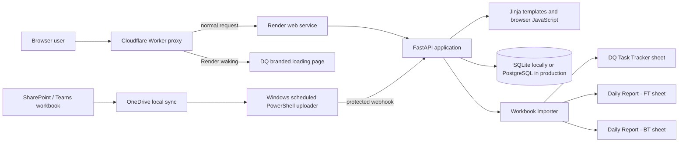
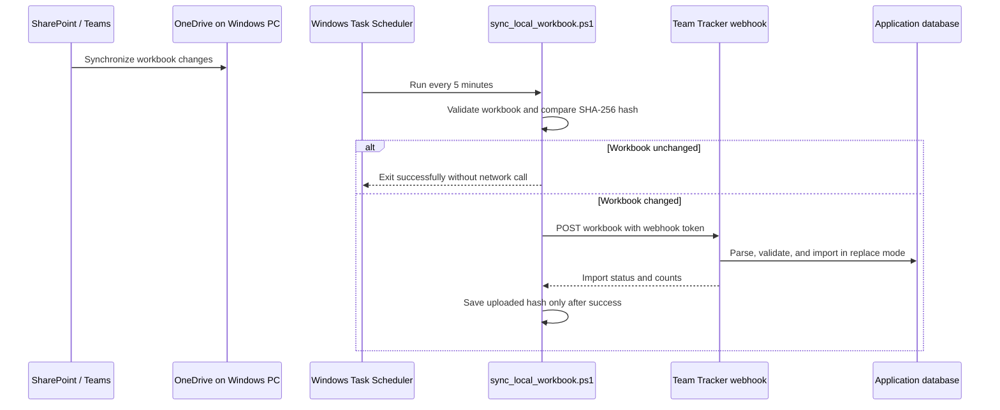

# DQ Team Tracker: End-to-End Guide

## 1. Executive Summary

DQ Team Tracker is a secure internal web application that turns the `DQ - Testing Tracker - 2026.xlsm` workbook into a shared operational tracker. It provides a live dashboard, monthly and weekly reporting, backlog and utilization views, controlled tracker-record editing, workbook imports, CSV downloads, and an audit trail.

The application is designed around two authoritative Excel data sources:

- `DQ Task Tracker`: master ticket lifecycle information.
- `Daily Report - FT`: daily functional-testing activity, effort, and test execution results.

`Daily Report - BT` is also supported by the general workbook importer and is recorded as BT work-log data. The current Excel Office Script and local scheduled sync are intentionally configured to send the two primary sheets above.

## 2. Business Value

- Replaces a desktop workbook workflow with a shared web view.
- Provides current reporting without manually rebuilding Excel charts.
- Controls access through Admin, Editor, and Viewer roles.
- Retains a traceable history of imports, data edits, user administration, and exports.
- Supports automatic workbook refresh from a OneDrive-synchronized SharePoint copy.
- Exports tracker records, work logs, and filtered monthly report details as CSV.

## 3. User-Facing Capabilities

| Area | What users can do | Main implementation |
|---|---|---|
| Dashboard | Review overall ticket, status, hours, test case, and test-step metrics | [dashboard.html](../app/templates/dashboard.html), [dashboard.py](../app/services/dashboard.py) |
| Monthly Tracker | Filter a month by tester, status, and ticket type; view effort and ticket details; export the selected result | [dashboard.html](../app/templates/dashboard.html), [exports.py](../app/routers/exports.py) |
| Weekly Tracker | Review weekly work activity within a selected month | [dashboard.html](../app/templates/dashboard.html) |
| Utilization | Review tester hours and calculated utilization | [dashboard.html](../app/templates/dashboard.html) |
| Backlog | Review created, closed, and month-end backlog metrics | [backlog.html](../app/templates/backlog.html), [dashboard.py](../app/services/dashboard.py) |
| Tracker | Search, filter, create, edit, and soft-delete master tickets according to permissions | [tracker.html](../app/templates/tracker.html), [tracker.py](../app/routers/tracker.py) |
| Import | Preview/import workbook files, view import history, view rejected rows, and review Windows scheduled-sync status | [import.html](../app/templates/import.html), [imports.py](../app/routers/imports.py) |
| Exports | Download tracker, work-log, and selected monthly-report CSV data | [exports.py](../app/routers/exports.py) |
| Administration | Create and manage users and roles | [admin.html](../app/templates/admin.html), [admin.py](../app/routers/admin.py) |
| Audit | Review tracked operational changes | [audit.html](../app/templates/audit.html), [audit.py](../app/routers/audit.py) |

## 4. Architecture



### Components

| Component | Responsibility |
|---|---|
| Browser UI | Server-rendered pages with small JavaScript calls for filters, charts, preview, import, and downloads. |
| Cloudflare Worker, optional | Stable public URL that proxies requests to Render and shows the DQ branded loader when the Render free service is waking. |
| Render static service | Hosts the standalone launch page in [launch/index.html](../launch/index.html). |
| Render web service | Runs the FastAPI application in the Docker container. |
| FastAPI | Routes web requests, applies authentication/permissions, calculates reports, parses imports, and exposes CSV downloads. |
| SQLAlchemy | Reads and writes application data using SQLite for local development or PostgreSQL in a shared deployment. |
| OpenPyXL | Reads `.xlsx` and `.xlsm` workbook content. |
| Windows scheduled task, optional | Runs a local PowerShell uploader every five minutes, but the uploader contacts Render only when the workbook content changed. |

## 5. Main Application Source

### Application entry point

[app/main.py](../app/main.py) creates the FastAPI application, installs CORS middleware, registers routers, serves static files, initializes the database on startup, and renders the top-level pages.

Important page routes:

| Route | Page |
|---|---|
| `/` | Dashboard |
| `/monthly` | Monthly Tracker |
| `/weekly` | Weekly Tracker |
| `/utilization` | Utilization report |
| `/backlog` | Backlog dashboard |
| `/tracker` | Tracker records |
| `/import` | Imports, sync status, and import history |
| `/admin` | User and role management |
| `/audit` | Audit log |
| `/health` | Service readiness check used by automation and proxies |

### Routers

| File | Responsibility |
|---|---|
| [auth.py](../app/routers/auth.py) | Login and logout; creates the access-token cookie. |
| [tracker.py](../app/routers/tracker.py) | Secured tracker record API: list, create, edit, soft-delete. |
| [imports.py](../app/routers/imports.py) | Workbook preview/import, webhook imports, Office Script JSON imports, history, and rejected-row CSV. |
| [dashboard.py](../app/routers/dashboard.py) | JSON metrics, filter values, and backlog data used by the pages. |
| [exports.py](../app/routers/exports.py) | CSV downloads for tracker records, work logs, and selected monthly report details. |
| [admin.py](../app/routers/admin.py) | Admin-only user and role operations. |
| [audit.py](../app/routers/audit.py) | Audit-log API. |

### Services

| File | Responsibility |
|---|---|
| [importer.py](../app/services/importer.py) | Finds headers, cleans Excel values, parses dates/numbers/statuses, validates rows, imports data, and records import batches. |
| [dashboard.py](../app/services/dashboard.py) | Produces ticket counts, effort, test execution metrics, charts, backlog, utilization, and report ticket details. |
| [audit.py](../app/services/audit.py) | Writes operational audit entries. |

### Data and configuration

| File | Responsibility |
|---|---|
| [models.py](../app/models.py) | Database tables and relationships. |
| [schemas.py](../app/schemas.py) | API request/response validation models. |
| [database.py](../app/database.py) | SQLAlchemy engine and per-request database sessions. |
| [config.py](../app/config.py) | Environment-variable based configuration. |
| [permissions.py](../app/permissions.py) | Permission names and Admin/Editor/Viewer default mappings. |
| [security.py](../app/security.py) | Bcrypt password handling and signed JWT access-token creation/validation. |
| [seed.py](../app/seed.py) | Initial roles, permissions, and reference data. |

### Presentation layer

| Location | Responsibility |
|---|---|
| [app/templates](../app/templates) | Server-rendered HTML views. |
| [app/static/app.js](../app/static/app.js) | Dashboard filtering/chart refresh, import preview/import interactions, and monthly CSV export URL construction. |
| [app/static/styles.css](../app/static/styles.css) | Responsive light/dark operational UI styles and import loading overlay. |

## 6. Data Model

| Table | Contents |
|---|---|
| `users` | Application users with password hash, role, and active status. |
| `roles` and `role_permissions` | Role-based authorization configuration. |
| `tracker_records` | Master ticket data imported from `DQ Task Tracker` or maintained in the Tracker view. |
| `work_logs` | Daily activity records imported from `Daily Report - FT` and supported BT data. |
| `imports` | Import batches, source file hash, mode, timing, result, and row counts. |
| `import_rows` | Rejected input rows and their validation error details. |
| `audit_logs` | Audit events for imports, edits, exports, and administration. |
| `lookups` | Seeded/reference values such as testers, statuses, and priorities. |

Records are soft-deleted using `deleted_at`; standard operational views exclude soft-deleted rows. `version` supports optimistic concurrency: a stale edit receives HTTP `409` instead of overwriting another user’s update.

The detailed Excel-to-database mapping is maintained in [data-mapping.md](data-mapping.md).

## 7. End-to-End Data Flows

### 7.1 Local automatic workbook sync: recommended operating flow



Source files:

- [sync_local_workbook.ps1](../scripts/sync_local_workbook.ps1): local uploader and hash-based change detection.
- [local_workbook_sync.config.ps1.example](../scripts/local_workbook_sync.config.ps1.example): safe configuration template.
- The actual `local_workbook_sync.config.ps1` is ignored by Git because it contains the local workbook path and webhook token.

Result in the application:

- Every successful local upload is labelled `windows_task_scheduler_sync.xlsm`.
- The Import page displays the latest Windows sync time in IST, import status, imported rows, and rejected rows.
- Identical workbook content is skipped locally before it can wake Render or create another import batch.

### 7.2 Manual Excel upload

1. Authorized user selects an `.xlsx` or `.xlsm` file in the Import page.
2. Browser posts it to `POST /api/imports`.
3. The application validates file extension and size.
4. A SHA-256 hash is compared with completed batches for the same import mode.
5. If unchanged, the application returns `status: unchanged` quickly.
6. If changed, OpenPyXL parses the workbook, validates rows, writes records, writes audit/import records, and returns the result.

The Import page shows a progress overlay only while the browser is waiting for preview/import work. It does not block the page on normal load.

### 7.3 Workbook parsing and validation

[importer.py](../app/services/importer.py) scans the first rows for recognized headers so minor workbook header positioning changes can be tolerated.

Key rules:

- Tracker rows require ticket ID, date started, tester, and status.
- Daily-report rows require tester and date; missing ticket IDs become `GENERAL`.
- Empty/template rows are ignored.
- Blank values, nonbreaking spaces, `-`, and common placeholder values are normalized.
- Excel serial dates and common date formats are supported.
- Common status variants are normalized, for example complete/completed and in-progress stages.
- Import mode is one of `merge`, `replace`, or `add`.

### 7.4 Office Script options

| Script | Use | Notes |
|---|---|---|
| [excel_office_sync.ts](../scripts/excel_office_sync.ts) | Manual Run button in Excel Online | Sends the selected workbook sheet data directly to the protected app endpoint using `fetch`. Its endpoint must be configured in Excel only, never committed. |
| [excel_power_automate_sync.ts](../scripts/excel_power_automate_sync.ts) | Power Automate Run script action | Returns selected sheet data to a flow. It cannot use `fetch`; a separate outbound connector action would be required to reach Team Tracker. |

### 7.5 Render keep-alive

[keep-alive.yml](../.github/workflows/keep-alive.yml) requests the health endpoint every ten minutes to reduce free-tier idle cold starts. It does not read or synchronize workbook data.

## 8. Reporting and CSV Exports

| Export | Endpoint | Contents |
|---|---|---|
| Tracker CSV | `/api/exports/tracker.csv` | Ticket lifecycle records. |
| Work Logs CSV | `/api/exports/work-logs.csv` | Imported daily activity: hours, test results, comments, source sheet, and source row. |
| Monthly CSV | `/api/exports/monthly.csv?month=YYYY-MM` | The Monthly Tracker ticket-detail report using its selected tester, status, and ticket-type filters. |
| Import errors CSV | `/api/imports/{import_id}/errors.csv` | Rejected rows, validation messages, and raw imported values for a batch. |

All standard data exports require `export_data` permission and are audit logged. The browser sends the CSV download with a file attachment header so it downloads instead of rendering as a page.

## 9. Security and Access Control

### Authentication

- Users authenticate with email and password.
- Passwords are hashed with bcrypt via Passlib.
- Successful login sets an `HttpOnly`, `SameSite=Lax` signed JWT cookie.
- The cookie uses the `SECURE_COOKIES` setting and should be secure in HTTPS production deployments.

### Authorization

| Role | Default access |
|---|---|
| Admin | All permissions, including all-record management, imports, exports, audit, and user administration. |
| Editor | Own-record creation/editing plus Excel import and export. |
| Viewer | Read access to own records plus export. |

The application hides unavailable menu items, but backend routes enforce permissions independently. Non-admin users see only their owned or created tracker records. Edit ownership checks occur in [tracker.py](../app/routers/tracker.py).

### Webhook protection

- Workbook sync webhook: `POST /api/imports/webhook`
- Office Script endpoint: `POST /api/imports/office-script-sync`
- Both require the configured `WEBHOOK_TOKEN` as a query token.
- Token comparisons use constant-time `hmac.compare_digest`.
- Real tokens must stay in Render environment variables, GitHub secrets where applicable, and ignored local configuration files. They must never be committed or included in screenshots or chat messages.

## 10. Deployment and Environments

### Docker and Render

[Dockerfile](../Dockerfile) builds a Python 3.11 slim image, installs [requirements.txt](../requirements.txt), and runs Uvicorn on port `10000`.

[render.yaml](../render.yaml) defines:

- Static launch service: `naren-tracker-launch`
- Docker-backed application service: `naren2503-team-tracker`

Important Render environment values:

| Variable | Purpose |
|---|---|
| `SECRET_KEY` | JWT signing secret. |
| `WEBHOOK_TOKEN` | Authorizes automated workbook sync uploads. |
| `DATABASE_URL` | SQLite locally or PostgreSQL in a shared deployment. |
| `SEED_ADMIN_EMAIL` / `SEED_ADMIN_PASSWORD` | Bootstrap admin user. |
| `SECURE_COOKIES` | Enables secure cookie delivery over HTTPS. |
| `CORS_ORIGINS` | Cross-origin policy. |

### Cold-start handling

The Render free service can sleep after inactivity. Three mitigations exist:

1. Static launch page: [launch/index.html](../launch/index.html) waits for `/health` and redirects when ready.
2. Keep-alive workflow: [.github/workflows/keep-alive.yml](../.github/workflows/keep-alive.yml) pings `/health` every ten minutes.
3. Cloudflare proxy: [cloudflare/worker.js](../cloudflare/worker.js) is the preferred user-facing solution because users remain on the Cloudflare URL even after refreshes. It serves the branded loader only when the Render origin is unavailable, then retries through a worker health endpoint.

The Cloudflare Worker must be deployed separately in the Cloudflare dashboard. Its generated `workers.dev` URL, or a custom domain attached to the Worker, becomes the URL users should bookmark and share.

## 11. Operations Runbook

### Routine checks

| Check | Where | Healthy result |
|---|---|---|
| Application readiness | `/health` | `{"status":"ready"}` |
| Last local sync | Import page, Windows Sync Status | Completed with current IST timestamp and zero rejected rows. |
| Import history | Import page | Recent `windows_task_scheduler_sync.xlsm` batch, or a clear rejected-row CSV. |
| Windows schedule | `schtasks.exe /Query /TN "DQ Team Tracker Workbook Sync" /FO LIST /V` | `Status: Ready`, a future Next Run Time, and `Last Result: 0` after a successful run. |
| OneDrive | Windows OneDrive status | The synchronized workbook has no pending sync/error state. |
| Render deployment | Render dashboard | Latest GitHub commit deployed successfully. |

### Common symptoms and actions

| Symptom | Likely cause | Action |
|---|---|---|
| Render welcome screen after refresh | User accessed direct Render URL while service slept | Use the Cloudflare Worker URL after it is deployed. |
| Windows sync did not import | OneDrive not current, PC asleep/offline, or transient Render cold start | Check OneDrive and Task Scheduler result; run the local PowerShell script visibly once for its error. |
| `Invalid token` | Local config token differs from Render `WEBHOOK_TOKEN` | Update the ignored local config with the current Render token. |
| Import takes time | Changed workbook needs a full parse and write | Wait for completion; identical uploads are now skipped. |
| No new Windows sync entry | Workbook hash unchanged | Expected behavior; no upload is needed. |
| CSV button does not work after deployment | Browser cached an old script | Reload normally after deployment; the JavaScript asset version is updated when export handlers change. |

## 12. Testing and Quality Controls

Automated tests are in [tests](../tests):

| Test file | Coverage |
|---|---|
| [test_importer.py](../tests/test_importer.py) | Workbook parsing, date/status normalization, and record/work-log linking. |
| [test_dashboard.py](../tests/test_dashboard.py) | Dashboard and backlog calculations. |
| [test_rbac.py](../tests/test_rbac.py) | Authentication/authorization, sync webhook safety, duplicate-workbook handling, import page data, and CSV export behavior. |

Run all tests locally:

```powershell
.\.venv\Scripts\python.exe -m pytest -q
```

Validate the local scheduled uploader syntax:

```powershell
$tokens = $null
$errors = $null
[System.Management.Automation.Language.Parser]::ParseFile(
  (Join-Path $PWD 'scripts\sync_local_workbook.ps1'),
  [ref]$tokens,
  [ref]$errors
) | Out-Null
$errors
```

## 13. Constraints and Recommended Next Steps

### Current constraints

- Render free instances may cold start after inactivity; Cloudflare proxy deployment is required to fully replace Render's loading screen during refreshes.
- The local automatic sync requires a powered-on, signed-in Windows PC with OneDrive running.
- A changed large workbook can take time to parse and replace because imports run in the request path.
- Office Scripts called by Power Automate cannot use external `fetch` calls; a Power Automate outbound integration requires an appropriate connector/license.
- The default local database is SQLite. PostgreSQL is recommended for sustained multi-user production use.

### Recommended improvements

1. Deploy the Cloudflare Worker and migrate users to its URL.
2. Use managed PostgreSQL for shared production data and implement schema migrations.
3. Move large imports to a background job queue with job-status polling, so browser requests return immediately.
4. Add retention cleanup for old import-row detail, audit data, and soft-deleted records based on an agreed policy.
5. Replace local password authentication with organizational Microsoft Entra ID when tenant access becomes available.

## 14. Source Map

```text
app/
  main.py                  Application setup and server-rendered page routes
  config.py                Environment configuration
  database.py              Database engine and sessions
  models.py                Database schema
  schemas.py               API contracts
  security.py              Password/JWT helpers
  dependencies.py          Authentication and permission dependencies
  permissions.py           Roles and permissions
  routers/                 API route handlers
  services/                Import, reporting, and audit business logic
  templates/               HTML pages
  static/                  JavaScript and CSS
scripts/
  sync_local_workbook.ps1  Change-aware local workbook uploader
  excel_office_sync.ts     Manual Excel Online direct-sync script
  excel_power_automate_sync.ts  Power Automate-compatible return-data script
cloudflare/
  worker.js                Edge proxy and branded cold-start page
.github/workflows/
  keep-alive.yml           Render health ping
launch/
  index.html               Static startup page
render.yaml                Render service configuration
Dockerfile                 Container build/run configuration
tests/                     Automated quality coverage
docs/                      Architecture, data mapping, and this guide
```
